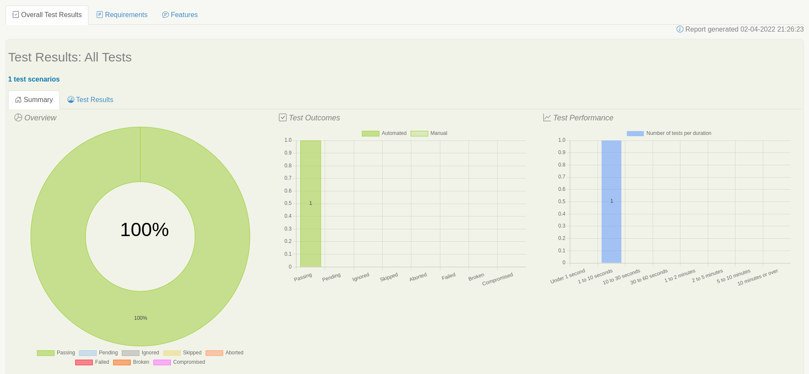

# Cucumber Serenity Demo
Demo project that demonstrates how to create BDD test scenarios in a Java project using Cucumber and Serenity

## How to run 
1. Run tests and generate Serenity report by executing: `mvn clean verify`
2. Check the report: /target/site/serenity/index.html

